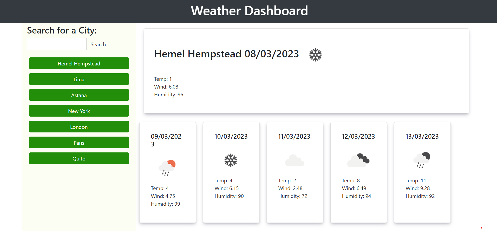

# Weather Dashboard

Search for the weather in different parts of the world.

## Description

This website receives weather data from an API (Openweather API), filters the information, and displays to the user, on this dashboard. It shows what the current weather is for any city in the world, what the next 5 days are going to be.

## Useage

To search for a forecast, simply enter a location in the search input, or click on one of the mose recent searches buttons.

## Screenshot

## The website

This site can be found at https://liamjameswatson.github.io/weather-website/

## License

MIT License (Please refer to LICENSE in the repo.)
